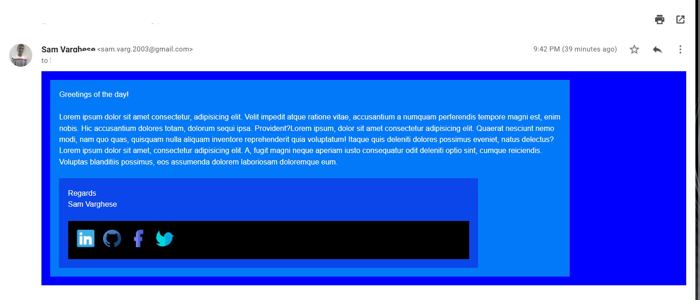
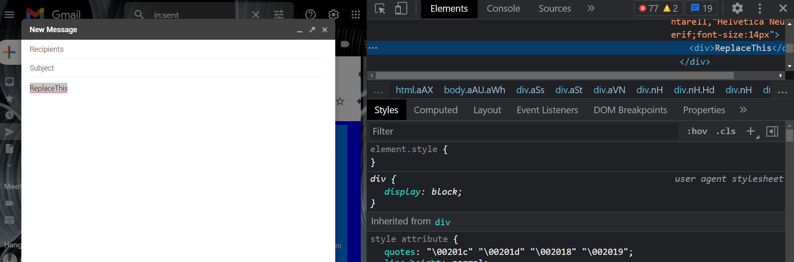
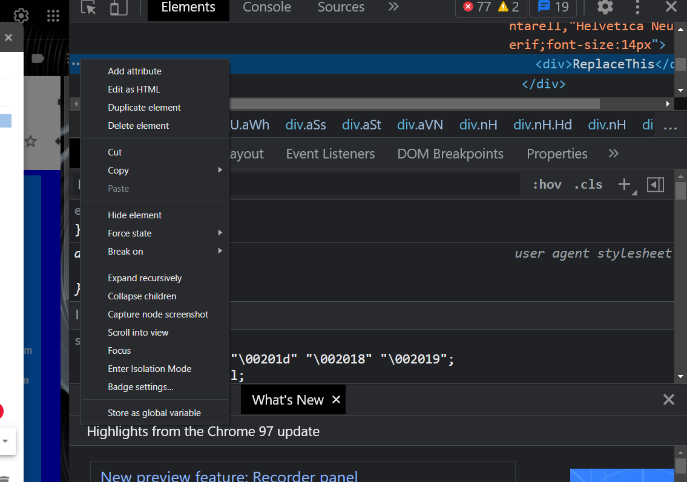
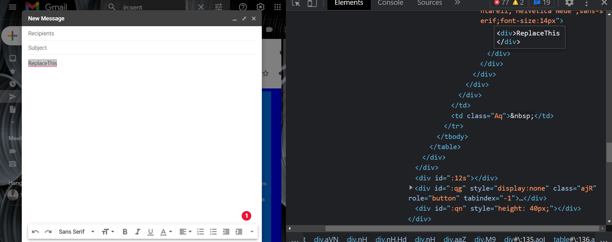
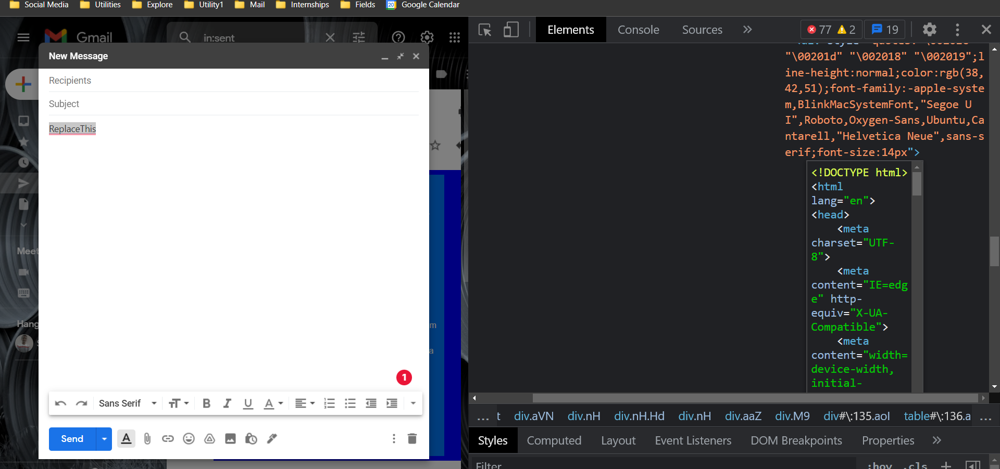
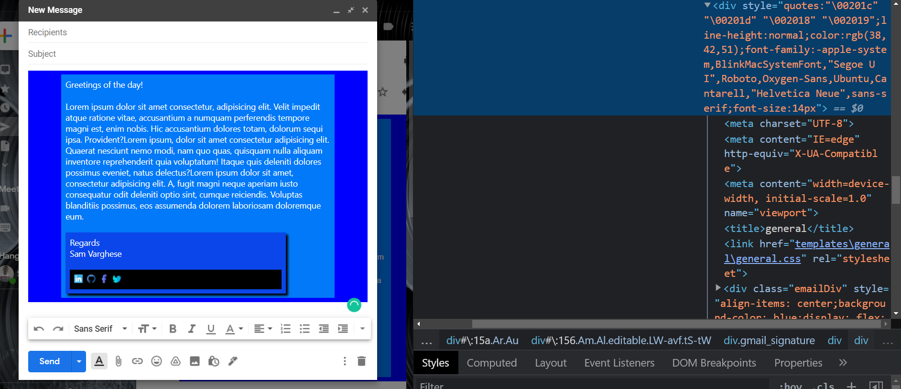

<h1 align="center">Email Beautifier</h1>

This is a program made in order to beautify mails using HTML, CSS/ Sass.

You can design emails using sass and HTML with the help of this program.

## Setup

1. Firstly fork the repo
2. Now clone it on your machine
3. Now run [initializer.py](initializer.py) and select option 1
4. This will install all important component required for the application
5. Now generate a component using option 2
6. A component is basically a mail template. You may create as many components (templates) as you want.
7. Generating a component will install [.scss](https://sass-lang.com/) and .html files.
8. Now execute [server.py](server.py) in order to start the server.
9. Now make the email template using html and .scss files that were generated by component generator inside templates folder.
10. Sass files will automatically get converted to .css files, and you'll find a folder namely Email where there is an output file.
11. Copy the code from that output folder.
12. Now compose a new mail, add any text, and inspect the element

13. Now click on the 3 dots, and select **Edit in HTML**

14. Replace all the text with the content you copied

15. Now click on anywhere outside that area, and you'll see you HTML, CSS region displayed in the mail region

